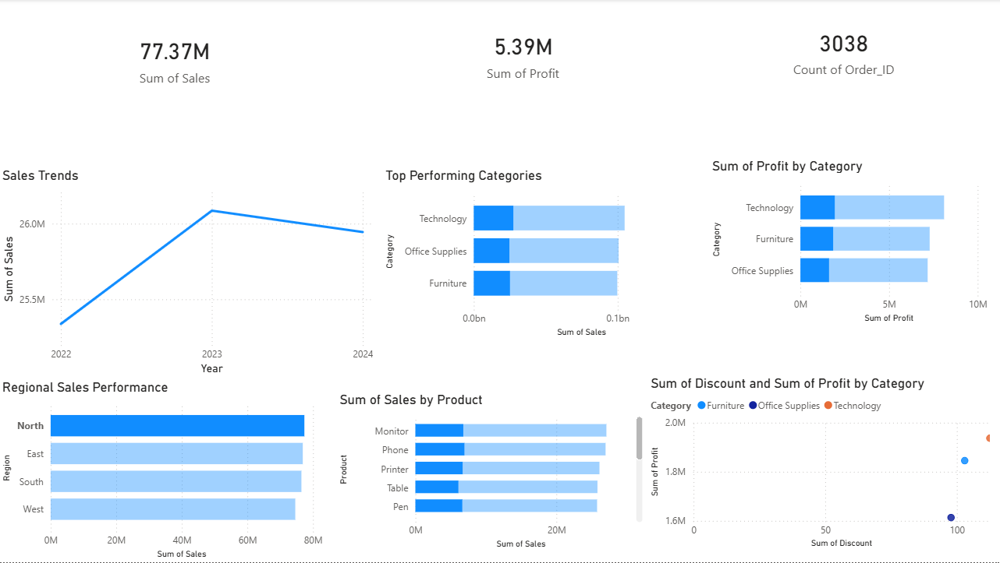

# 📊 Global Sales & Profit Performance Dashboard

## 📝 Project Overview
This is my **first Data Analytics project**. I built an interactive dashboard to analyze sales trends and profitability across different product categories and regions. 

The goal was to identify which areas of the business are growing and where we need to improve profit margins.

---

## 🖼️ Dashboard Preview

---

## 🚀 Key Insights & Findings
* **Revenue Growth:** Sales saw a significant recovery in 2024 after a slight dip in 2023.
* **Top Category:** **Technology** is our strongest category, leading in both total sales and net profit.
* **Operational Scale:** Managed and visualized data for over **3,900+ unique orders**.
* **Regional Performance:** Identified the North and West regions as key areas for market expansion.

---

## 🛠️ Tools & Skills
* **Tool:** Power BI Desktop
* **Skills:** Data Visualization, KPI Tracking, Data Cleaning, Dashboard Design.
* **Calculations:** Used DAX for calculating Total Sales, Profit, and Order Counts.

---

## 📁 How to View the Project
1. Download the `.pbix` file from this repository.
2. Open it using **Power BI Desktop**.
3. Explore the interactive filters for Years and Regions!
